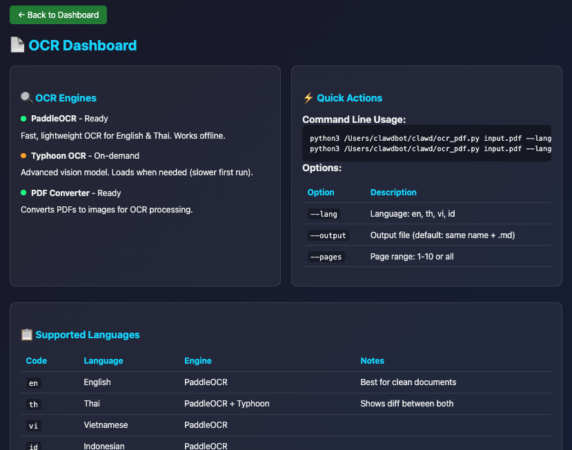
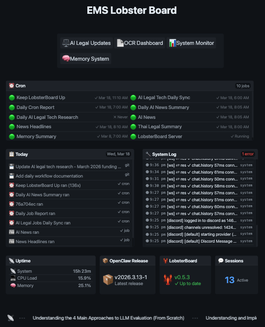

# Legal AI Projects

System architectures and design documentation for legal AI tools built for real-world legal practice — regulatory knowledge systems, workflow automation, and retrieval-augmented generation (RAG) pipelines.

**Built by a U.S.-qualified technology lawyer working across ASEAN jurisdictions.**

This repository documents the architecture, design decisions, and system flows behind a portfolio of legal AI tools currently in production or active development. Source code is maintained in private repositories. What follows is the engineering reasoning — the *why* and *how* behind each system.

---

## At a Glance (for this portfolio)

| Metric | |
|---|---|
| **Combined codebase** | 80,000+ lines (Python, JavaScript, HTML/CSS, Markdown) |
| **Total commits** | 1,500+ across all projects |
| **Production files** | 250+ tracked files |
| **First commit** | 2023 |
| **Stack** | Python · Direct LLM API integration (Gemini, Claude, GPT, MiniMax) · Custom prompt orchestration · Full deployment pipelines |

---

## Projects

### [Translation Pipeline](./translation-pipeline/)
**Structure-preserving AI translation pipeline for legal documents**

- **Multi-model routing** — separate models for OCR correction, table reconstruction, and translation, each with task-appropriate temperature tuning
- **Language-aware prompt architecture** — specialized prompts where linguistically necessary (Thai, Bengali), generic prompts where not
- **Anti-runaway chunking** — production-hardened protections against LLM content expansion and infinite recursion in long documents
- **Hybrid extraction routing** — born-digital PDFs go through native extraction with page-level layout classification; scanned documents and raster images route to Google Document AI Enterprise OCR
- **Review-aware output** — structured findings identify where human inspection is needed, rather than silently passing risky output
- **Inputs:** PDF, images, public webpages (DOCX and URL inputs in testing)
- **Outputs:** Markdown, DOCX, HTML, PDF
- **Downstream integration:** outputs designed to feed directly into the [Legal Knowledge Base](./legal-knowledge-base/) as ingestion-ready source material for RAG

<div align="center">
  
  <br><em>Home — Quick Translation and Advanced Mode entry points</em>
  <br><sub>As of 18 March 2026</sub>
</div>

<p>&nbsp;</p>

<div align="center">
  
  <br><em>Advanced Mode — Step-by-step pipeline control with per-stage review</em>
  <br><sub>As of 18 March 2026</sub>
</div>

<p>&nbsp;</p>

<div align="center">
  
  <br><em>Task Dashboard — Production usage tracking across translation jobs</em>
  <br><sub>As of 18 March 2026</sub>
</div>

<p>&nbsp;</p>

```
Pipeline Steps                                        🤖 = AI-powered step
──────────────────────────────────────────────────

Step 1 ─ Convert to Markdown
           ├── DOCX and born-digital PDF →
           │     ├── Local extraction + layout classification
           │     └── Sensitive information anonymization (coming soon) 🤖
           ├── Scanned documents and images →
           │     ├── Sensitive information anonymization (coming soon) 🤖
           │     └── Cloud OCR 🤖
           └── Public webpage URL → HTML extraction + Markdown conversion

Step 2 ─ Correct and Normalize
           ├── OCR correction, language-aware 🤖
           ├── Table reconstruction 🤖
           ├── Numbering validation, mixed numeral systems 🤖
           ├── Structural analysis → review findings 🤖
           └── Text cleanup 🤖

Step 3 ─ Translate
           ├── Language-pair-specific prompt templates 🤖
           ├── Critical-term preservation
           ├── Deterministic substitutions
           ├── Post-translation review checks 🤖
           └── Re-insert sensitive information (coming soon)

Step 4 ─ Export
           ├── Markdown  ─┐
           ├── DOCX       │→ with review signals carried forward
           ├── HTML       │
           └── PDF       ─┘
```

→ [Architecture & Design](./translation-pipeline/README.md)

---

### [OpenClaw Harness](./openclaw-harness/)
**LLM-to-OS bridge for local task execution**

OpenClaw connects LLM reasoning to a local execution runtime, enabling automated task execution through filesystem operations, shell commands, application control, and network requests. This deployment integrates multiple models (MiniMax 2.5 Pro for routine operations, Claude Sonnet for complex reasoning) with explicit routing logic. LobsterBoard provides the operational dashboard for managing mini-apps, scheduled jobs, monitoring execution, and system analytics.

<div align="center">
  
  <br><em>OCR Dashboard — Multi-engine document processing with ASEAN language support</em>
  <br><sub>As of 18 March 2026</sub>
</div>

<p>&nbsp;</p>

→ [Architecture & Design](./openclaw-harness/README.md)

---

### [Legal Knowledge Base](./legal-knowledge-base/)
**Files-first ingestion system for legal RAG**

Ingestion and chunking pipeline for primary legal regulations, secondary legal resources, templates, and practice notes — designed as the foundation for a retrieval-augmented generation system. A planned upstream source is the [Translation Pipeline](./translation-pipeline/), whose structure-corrected translated output is designed to flow directly into ingestion. Currently operational for document processing and structured storage; RAG retrieval layer is in active development.

→ [Architecture & Design](./legal-knowledge-base/README.md)

---

### [Automated Research Pipelines](./automated-research-pipelines/)
**Scheduled AI-driven research, summarization, and distribution**

A set of autonomous pipelines running on cron schedules via OpenClaw. Each pipeline spawns an isolated agent session, performs targeted web research, produces LLM-generated summaries, and distributes results to Discord channels and dashboards. Currently runs daily news briefings and an AI legal tech jobs/funding tracker.

<div align="center">
  
  <br><em>LobsterBoard — Cron schedules, activity log, system monitoring, and live sessions</em>
  <br><sub>As of 18 March 2026</sub>
</div>

<p>&nbsp;</p>

→ [Architecture & Design](./automated-research-pipelines/README.md)

---

### [Fee Proposal Generator](./fee-proposal-generator/)
**Automated fee proposal drafting for legal engagements**

Generates structured fee proposals from intake parameters — scope, personnel, billing/deposit requirements. Reduces a 2–3 hour manual drafting process to minutes while maintaining firm-specific formatting and compliance with engagement standards.

→ [Architecture & Design](./fee-proposal-generator/README.md)

---

### [Docx Styler](./docx-styler/)
**AI-driven paragraph styling for Word documents**

Applies consistent paragraph-level styling to legal Word documents using AI classification. Addresses the endemic problem of inconsistent formatting in documents that pass through multiple hands — associates, partners, clients, opposing counsel — before final production.

→ [Architecture & Design](./docx-styler/README.md)

---

### [SHA-SG](./sha-sg/)
**Singapore venture capital templates under version control**

Places standard Singapore law venture capital template agreements (shareholders' agreement, subscription agreement, constitution) into structured version control. Tracks clause-level changes across template revisions and enables diffing between template versions.

→ [Architecture & Design](./sha-sg/README.md)

---

## Design Philosophy

These systems share a common set of architectural principles:

- **Direct API integration over frameworks.** No LangChain, no LlamaIndex. Every LLM call is a deliberate, auditable API call with custom prompt management. This trades convenience for control — essential when outputs carry legal consequences.

- **Model routing by task complexity.** Lightweight models handle routine extraction and classification. Capable models handle reasoning, drafting, and ambiguous interpretation. Cost and latency stay proportional to difficulty.

- **Legal-native data models.** Document structures, metadata schemas, and output formats are designed around how lawyers actually work — not retrofitted from general-purpose AI tooling.

- **Deployment where it matters.** Production systems ship with full deployment pipelines. Smaller tools (Docx Styler, SHA-SG) are designed as local utilities — deployed to the environments where they're actually used.

- **Review-aware over silently confident.** Legal output that looks correct but isn't is worse than output that flags its own uncertainty. These systems are designed to surface risk, not hide it — structured review findings, propagated warnings, and explicit "review required" signals are first-class features, not afterthoughts.

---

## About

U.S.-qualified technology lawyer at DFDL Legal & Tax, where I serve on the AI Strategic Initiative committee, lead Knowledge Management, and champion firm-wide workflow automation. I design and build the AI systems documented here — 80,000+ lines of production code across legal translation, knowledge management, document automation, and workflow orchestration. Based in ASEAN, where I work across Thai, Singaporean, and regional legal frameworks.

For more: [emsato.com](https://emsato.com) or [LinkedIn](https://www.linkedin.com/in/emsato/)

---

*Last updated: 26 March 2026*
