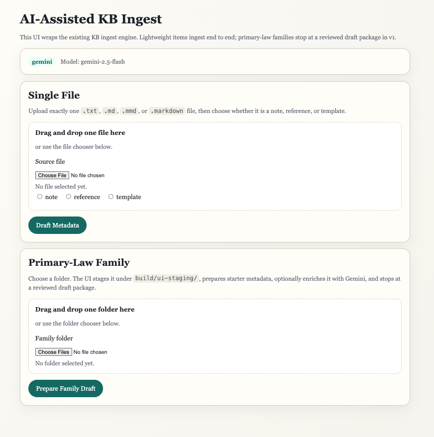
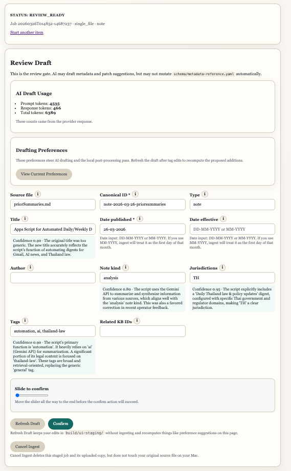

# Legal AI Projects

Public-facing architecture and design notes for legal AI systems built for real-world practice across ASEAN jurisdictions.

This public repository explains the architecture, design decisions, and system flows behind a portfolio of legal AI projects whose implementation lives in private repositories. It is not a source-code mirror. Its purpose is to document what each system is for, how it is structured, and why it was designed that way.

---

## Table of Contents

- [Portfolio at a Glance](#portfolio-at-a-glance)
- [Projects](#projects)
  - [Translation Pipeline](#translation-pipeline)
  - [Legal Knowledge Base](#legal-knowledge-base)
  - [Legal Wiki](#legal-wiki)
  - [Automated Research Pipelines](#automated-research-pipelines)
  - [Fee Proposal Generator](#fee-proposal-generator)
  - [DOCX Styler](#docx-styler)
  - [SHA-SG](#sha-sg)
- [Design Philosophy](#design-philosophy)
- [About](#about)

---

## Portfolio at a Glance

| Metric | Detail |
|---|---|
| **Combined codebase** | 140,000+ lines (Python, JavaScript, HTML/CSS, Markdown) |
| **Total commits** | 1,600+ across all projects |
| **Production files** | 750+ tracked files (excluding knowledge base content) |
| **First commit** | 2023 |
| **Stack** | Python · Direct LLM API integration (Gemini, Claude, GPT, MiniMax) · Custom prompt orchestration · Full deployment pipelines |

The portfolio’s core knowledge flow is:

`Translation Pipeline -> Legal Knowledge Base -> Legal Wiki`

---

## Projects

### [Translation Pipeline](./translation-pipeline/)
**A complete AI-assisted system built specifically for legal and regulatory document translation** · *In active use*

- **Multi-model routing** — separate models for OCR correction, table reconstruction, and translation, each with task-appropriate temperature tuning
- **Language-aware prompt architecture** — specialized prompts where linguistically necessary (Thai, Bengali), generic prompts where not
- **Anti-runaway chunking** — production-hardened protections against LLM content expansion and infinite recursion in long documents
- **Hybrid extraction routing** — born-digital PDFs go through local native extraction with page-level layout classification; scanned documents and raster images route to a switchable cloud OCR lane (currently, Google Document AI or Datalab)
- **Partner API** — server-to-server REST API with bearer-token auth, webhook delivery with HMAC signatures, idempotency keys, and per-partner rate and concurrency limits
- **Review-aware output** — structured findings identify where human inspection is needed, rather than silently passing risky output
- **Inputs:** PDF, DOCX, images, public webpages
- **Outputs:** Markdown, DOCX, HTML, PDF
- **System role:** the first stage in the `Translation Pipeline -> Legal Knowledge Base -> Legal Wiki` chain
- **Downstream integration:** outputs designed to feed directly into the [Legal Knowledge Base](./legal-knowledge-base/) as ingestion-ready source material, with the Legal Wiki consuming source-backed citations downstream

<div align="center">
  
  <br><em>Home — Quick Translation and Advanced Mode entry points</em>
  <br><sub>As of 18 March 2026</sub>
</div>

<p>&nbsp;</p>

<div align="center">
  
  <br><em>Advanced Mode — Step-by-step pipeline control with per-stage review</em>
  <br><sub>As of 18 March 2026</sub>
</div>

<p>&nbsp;</p>

<div align="center">
  
  <br><em>Task Dashboard — Production usage tracking across translation jobs</em>
  <br><sub>As of 18 March 2026</sub>
</div>

<p>&nbsp;</p>

```
Pipeline Steps                                        🤖 = AI-powered step
──────────────────────────────────────────────────

Step 1 ─ Convert to Markdown
           ├── DOCX and born-digital PDF →
           │     ├── Local extraction + layout classification
           │     └── Sensitive information anonymization (coming soon) 🤖
           ├── Scanned documents and images →
           │     ├── Sensitive information anonymization (coming soon) 🤖
           │     └── Cloud OCR (switchable: Google Document AI / Datalab) 🤖
           └── Public webpage URL → HTML extraction + Markdown conversion

Step 2 ─ Correct and Normalize
           ├── OCR correction, language-aware 🤖
           ├── Table reconstruction 🤖
           ├── Numbering validation, mixed numeral systems 🤖
           ├── Structural analysis → review findings 🤖
           └── Text cleanup 🤖

Step 3 ─ Translate
           ├── Language-pair-specific prompt templates 🤖
           ├── Critical-term preservation
           ├── Deterministic substitutions
           ├── Post-translation review checks 🤖
           └── Re-insert sensitive information (coming soon)

Step 4 ─ Export
           ├── Markdown  ─┐
           ├── DOCX       │→ with review signals carried forward
           ├── HTML       │
           └── PDF       ─┘

Partner API ─ Server-to-server integration
           ├── Bearer-token auth with per-partner limits
           ├── Job lifecycle: create, poll, cancel, purge
           ├── Webhook delivery with HMAC signatures
           └── Idempotency keys for safe retries
```

→ [Architecture & Design](./translation-pipeline/README.md)

---

### [Legal Knowledge Base](./legal-knowledge-base/)
**Files-first canonical legal knowledge layer** · *In active development*

The Legal Knowledge Base (LKB) is the authoritative legal source layer for the system: ingestion, versioned Markdown, provenance, validation, audit trail, and SQLite-backed search.

- **System role:** the canonical middle layer in `Translation Pipeline -> Legal Knowledge Base -> Legal Wiki`
- **Planned upstream source:** the [Translation Pipeline](./translation-pipeline/), whose structure-corrected translated output is designed to flow directly into LKB ingestion
- **Current status:** ingestion, validation, UI-assisted review, canonical storage, and search indexing are operational
- **Downstream role:** the LKB provides the source-backed citations that the Legal Wiki uses for synthesis pages

<div align="center">
  
  <br><em>AI-Assisted KB Ingest — single-file and primary-law family intake</em>
  <br><sub>As of 26 March 2026</sub>
</div>

<p>&nbsp;</p>

<div align="center">
  
  <br><em>Review Draft — human review interface with AI-suggested metadata refinements</em>
  <br><sub>As of 26 March 2026</sub>
</div>

<p>&nbsp;</p>

→ [Architecture & Design](./legal-knowledge-base/README.md)

---

### Legal Wiki
**Synthesis-only legal wiki layer** · *In active development*

The Legal Wiki (LW) turns source-backed Legal Knowledge Base materials into living synthesis pages: topics, issues, concepts, timelines, entities, and questions.

- **System role:** the synthesis layer in `Translation Pipeline -> LKB -> LW`
- **Authority boundary:** the LW is not canonical legal authority; it summarizes and compares the LKB
- **Source grounding:** pages carry LKB references and use citation-backed excerpts rather than duplicating full legal text
- **Authoring flow:** page helpers support both blank page creation and source-grounded draft generation, with human review still required

---

### [Automated Research Pipelines](./automated-research-pipelines/)
**Scheduled AI-driven research, summarization, and distribution** · *In active use*

A set of autonomous pipelines running on scheduled agent sessions. Each run performs targeted web research, produces structured summaries, and distributes results to Discord channels and dashboards. Current use cases include daily news briefings and tracking company developments, funding activity, and market movements across the AI legal sector.

→ [Architecture & Design](./automated-research-pipelines/README.md)

---

### [Fee Proposal Generator](./fee-proposal-generator/)
**Automated fee proposal drafting for legal engagements** · *Retired — replaced by firm-wide legal AI platform*

Generates structured fee proposals from intake parameters — scope, personnel, billing/deposit requirements. Reduces a 2–3 hour manual drafting process to minutes while maintaining firm-specific formatting and compliance with engagement standards.

→ [Architecture & Design](./fee-proposal-generator/README.md)

---

### [DOCX Styler](./docx-styler/)
**AI-driven paragraph styling for Word documents** · *Retired — replaced by firm-wide legal AI platform*

Applies consistent paragraph-level styling to legal Word documents using AI classification. Addresses the endemic problem of inconsistent formatting in documents that pass through multiple hands — associates, partners, clients, opposing counsel — before final production.

→ [Architecture & Design](./docx-styler/README.md)

---

### [SHA-SG](./sha-sg/)
**Singapore venture capital templates under version control** · *In use*

Places standard Singapore law venture capital template agreements (shareholders' agreement, subscription agreement, constitution) into structured version control. Tracks clause-level changes across template revisions and enables diffing between template versions.

→ [Architecture & Design](./sha-sg/README.md)

---

## Design Philosophy

These systems share a common set of architectural principles:

- **Direct API integration over frameworks.** No LangChain, no LlamaIndex. Every LLM call is a deliberate, auditable API call with custom prompt management — essential when outputs carry legal consequences.

- **Model routing by task complexity.** Lightweight models handle routine extraction and classification. Capable models handle reasoning, drafting, and ambiguous interpretation. Cost and speed stay proportional to difficulty.

- **Canonical first, synthesis second.** The LKB holds controlling legal text and citations. The LW organizes, compares, and explains that material without replacing it.

- **Legal-native data models.** Clause hierarchies, numbered sections, mixed numeral systems, and bilingual instrument pairs are modeled as first-class structures, not flattened into plain text.

- **Review-aware over silently confident.** Output that looks correct but has hidden defects is a serious risk for legal work. These systems surface uncertainty rather than hide it — structured review findings and explicit warnings are first-class features.

---

## About

- **Background:** U.S.-qualified technology lawyer at DFDL Legal & Tax
- **AI leadership roles:** AI Strategic Initiative committee member, regional lead for Knowledge Managers, and Legal AI Workflows Champion
- **Builder:** designer and developer of the AI systems documented here — 80,000+ lines of production code across legal translation, knowledge management, document automation, and workflow orchestration
- **Region:** based in ASEAN, working across Thai, Singaporean, and regional legal frameworks

For more information: [emsato.com](https://emsato.com) or [LinkedIn](https://www.linkedin.com/in/emsato/)

---

*Last updated: 12 April 2026*
