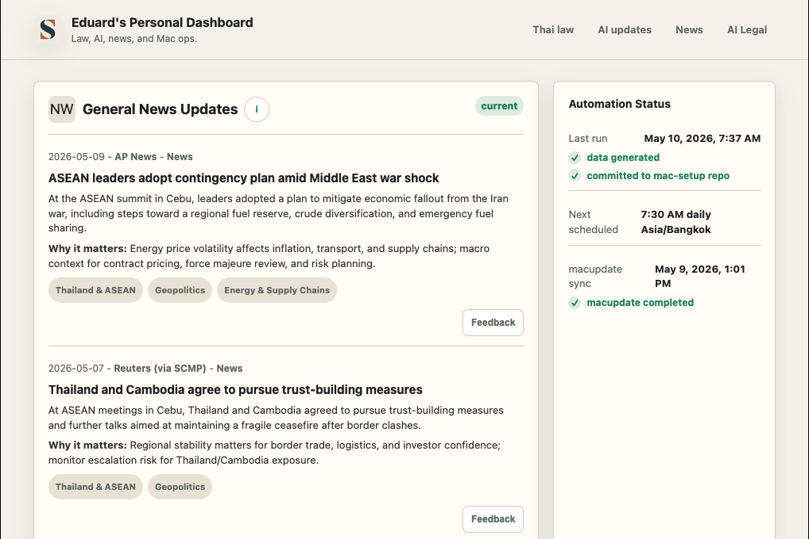

# Automated Research Pipelines

**Scheduled AI-driven research, summarization, and distribution**

A set of autonomous research and monitoring pipelines that run on scheduled agent sessions. Each run performs targeted web research, Gmail-backed source review, page-change checks, or structured dashboard maintenance, produces source-backed summaries, writes dashboard data, and commits the updated research store when the workflow calls for publication. The dashboard keeps output browsable by tag, date range, tracked company, jurisdiction, saved-review state, monitor history, automation health, and AI Legal company analytics.

<div align="center">
  
  <br><em>Current dashboard snapshot - source-backed research items, clickable tags, feedback controls, and automation status</em>
  <br><sub>As of 10 May 2026</sub>
</div>

<p>&nbsp;</p>

---

## Problem

Staying current across fast-moving domains — developments across the AI legal sector, regulatory developments, industry news — requires daily manual effort: scanning multiple sources, filtering noise, synthesizing what matters, and sharing it with the right audience. This is exactly the kind of repetitive, high-frequency knowledge work that benefits from automation.

These pipelines replace that daily manual scan with scheduled, AI-driven research that runs reliably, covers more ground, preserves historical items, and keeps the output easy to browse by topic. User feedback on tags, relevance, and priority becomes input for the next run instead of disappearing into a separate notes process.

---

## Architecture Overview

```
┌─────────────────────────────────────────────────────┐
│            SCHEDULED AGENT RUN                      │
│                                                     │
│  Cron / automation → Isolated research session      │
└──────────────────────┬──────────────────────────────┘
                       │
                       ▼
┌─────────────────────────────────────────────────────┐
│              RESEARCH PHASE                         │
│                                                     │
│  Web search → Source filtering →                    │
│  Content Extraction → Domain-Specific Focus         │
└──────────────────────┬──────────────────────────────┘
                       │
                       ▼
┌─────────────────────────────────────────────────────┐
│            SYNTHESIS AND STRUCTURING                │
│                                                     │
│  LLM analysis → Structured summary generation →     │
│  Source Attribution → Quality Formatting            │
└──────────────────────┬──────────────────────────────┘
                       │
                       ▼
┌─────────────────────────────────────────────────────┐
│              DASHBOARD OUTPUT                       │
│                                                     │
│  Historical JSON stores · Markdown content ·        │
│  Git commit/push · Dashboard status · Tag views ·   │
│  Saved review queue · Automation health rows ·      │
│  Page-watchlist history · AI Legal analytics views  │
└──────────────────────┬──────────────────────────────┘
                       │
                       ▼
┌─────────────────────────────────────────────────────┐
│              USER REVIEW LOOP                       │
│                                                     │
│  Article feedback → Feedback inbox →                │
│  Next scheduled research run                        │
└─────────────────────────────────────────────────────┘
```

---

## Pipelines

### 1. Daily Briefing Modules

Scheduled jobs research specific domains each morning and update dashboard-backed data stores.

Current modules:

- **Thai law and regulatory updates** — Royal Gazette and regulator-focused monitoring.
- **AI updates** — model, product, agent/tool, enterprise, safety, infrastructure, and policy developments.
- **General news** — Thailand/ASEAN, global macro, markets, geopolitics, supply chains, technology, and policy context.
- **AI legal-sector tracking** — company developments, funding, hiring, product/workflow changes, law firm adoption, in-house legal AI, market structure, and company analytics.
- **Crypto News** — Gmail-backed review of selected newsletter sources, preserved article history, and batch-based homepage rotation.
- **Thai DABOs** — Thai SEC-licensed digital asset business operator tracking plus ICO Portal/token-offering research.

**Flow:**
1. Scheduled automation starts the run.
2. The agent searches current sources or reviews configured inbound sources for each module.
3. Items are filtered, summarized, tagged, and linked back to source URLs or source metadata.
4. New items merge into existing historical item lists instead of replacing prior entries.
5. Dashboard data and content files are committed and pushed when the workflow publishes output.

**Output:** Dashboard-ready JSON and Markdown content with source-backed summaries, stable item IDs, tags, dates, and impact notes.

### 2. Crypto Regulation Modules

The dashboard includes structured crypto-regulation views for Tier 1 and Tier 1.5 jurisdictions. These modules track source-backed jurisdiction summaries, current regulatory posture, licensing or registration signals, market-structure developments, and follow-up points for deeper review.

- **Tier 1 Crypto Regulation** — United States, European Union, Singapore, Japan, Switzerland, United Kingdom, and Hong Kong.
- **Tier 1.5 Crypto Regulation** — UAE/Dubai/ADGM, Australia, Cayman Islands, BVI, Bermuda, Gibraltar, Seychelles, and South Korea.

### 3. Regulatory Watchlists

Alongside article-based research, the dashboard also carries page-change monitors for selected regulatory and reference pages where structural change matters more than article volume. These watchlists retain prior baselines, track different check cadences by tier, preserve recent-change history, and keep unreviewed changes visible until acknowledged.

### 4. AI Legal Company Analytics

The AI Legal surface is now more than a stream of tagged updates. It also includes tracked-company profile pages and comparative analytics across funding, valuation, headquarters, hiring, and market-position groupings so recurring company checks can be reviewed as structured market maps instead of article fragments alone.

### 5. Feedback-Aware Updates

The dashboard includes article-level feedback. Feedback is saved locally, read by the next scheduled run, and used to adjust tagging, relevance, and future prioritization.

Supported feedback classes:

- wrong tag
- missing tag
- more like this
- less like this
- not relevant
- high priority

The next run treats that feedback as instruction-level input:

- **Wrong tag / missing tag** - reconsider the article's taxonomy.
- **More like this / less like this** - tune future selection.
- **Not relevant / high priority** - update relevance and escalation rules.

Processed feedback is archived outside the committed dashboard content.

### 6. Review Surfaces

Tags remain first-class navigation, but the dashboard is now also a review surface for tracked-company pages, AI Legal analytics, jurisdiction modules, saved items, front-page automation health, and retained page-watchlist history.

Review surfaces support:

- cross-module review of recurring topics
- jurisdiction-specific crypto regulation review
- tracked-company review using exact company tags
- AI Legal market-map review through funding, valuation, location, and hiring lenses
- saved-item follow-up without keeping completed items pinned in the main stream
- retained watchlist diff history with explicit acknowledgement after review
- date-range review across 15 days, 30 days, 6 months, 1 year, or all history

---

## Design Decisions

**Why isolated sessions?**
Each pipeline runs in its own agent session, fully isolated from the main operator session. This prevents research tasks from polluting the active context window and allows clean teardown after completion. If a pipeline fails, it fails in isolation.

**Why dashboard-backed historical stores?**
Research updates are more useful when they accumulate. The dashboard keeps historical item lists, supports tag filters and date-range views, and lets recurring topics become searchable over time rather than disappearing after a single notification.

**Why a user feedback loop?**
Automated classification needs correction paths. Article-level feedback gives the user a low-friction way to flag wrong tags, missing tags, poor relevance, or high-priority patterns. The next run reads those signals before generating new output.

**Why Git as the durable record?**
Daily research output changes over time, and the history matters. Git gives every run a diffable record of what changed, when it changed, and which data/content files were updated.

**Why keep legacy process references?**
Earlier Discord-first dashboard processes are useful as process studies, but the current dashboard does not depend on those runtime codebases. They inform the workflow shape without becoming live dependencies.

---

## Dependencies

- **Scheduled agent runtime** — isolated research sessions
- **Web search** — source discovery and verification
- **LLM analysis** — summarization, classification, and synthesis
- **Git** — version-controlled research data and content
- **Dashboard layer** — historical views, module pages, tag filtering, feedback controls, and automation status

---

## Tech Stack

- Custom agent runtime (isolated session management)
- LLM-backed summarization and classification
- Web search and source extraction
- Git-based research file management
- Local dashboard data/content stores
- Scheduled automations
- Feedback inbox and archive workflow
- Tag index and filtered historical views

---

*→ Back to [Project Index](../README.md)*
