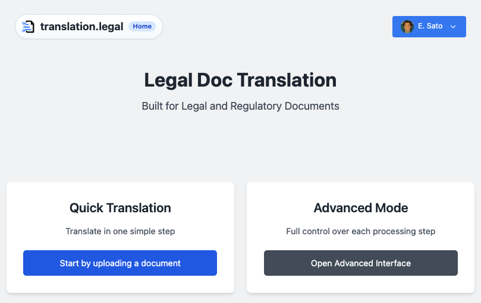
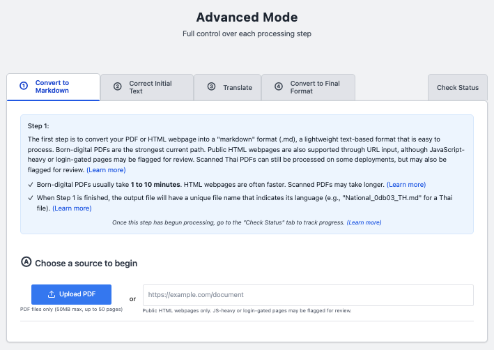
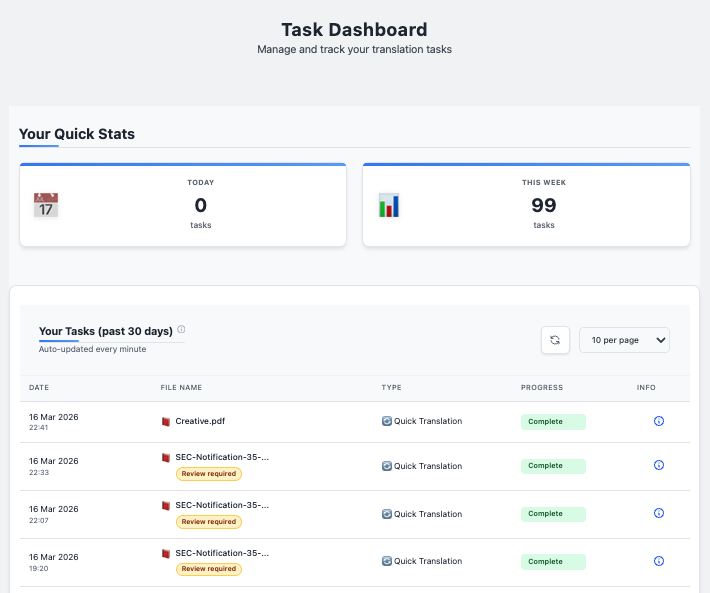

# Translation Pipeline

**AI-assisted legal and regulatory document translation workflow**

This project is a production-oriented translation pipeline for long-form legal and regulatory documents. It is designed for cases where ordinary machine translation is not enough because the document structure matters as much as the wording: numbered clauses, tables, notes, headings, cross-references, and formatting all need to survive the workflow.

The system is built around a 4-step pipeline:

1. **Convert** source material into Markdown
2. **Correct** OCR and structural issues
3. **Translate** with language-pair-specific prompts and term handling
4. **Export** to final formats such as DOCX, HTML, and PDF

**Live app (development server):** [dev.translation.legal](https://dev.translation.legal)

---

## Screenshots

<div align="center">
  
  <br><em>Home — Quick Translation and Advanced Mode entry points</em>
  <br><sub>As of 18 March 2026</sub>
</div>

<p>&nbsp;</p>

<div align="center">
  
  <br><em>Advanced Mode — Step-by-step pipeline control with per-stage review</em>
  <br><sub>As of 18 March 2026</sub>
</div>

<p>&nbsp;</p>

<div align="center">
  
  <br><em>Task Dashboard — Production usage tracking across translation jobs</em>
  <br><sub>As of 18 March 2026</sub>
</div>

<p>&nbsp;</p>

---

## What This Project Is Solving

General-purpose translation tools often perform reasonably well on short text, but legal documents introduce a different class of problems:

- Clause numbering can drift or flatten
- Tables can collapse into plain prose
- Notes and cross-references can move or disappear
- Key legal terms can be translated inconsistently across a long document
- OCR noise can silently propagate into the final output

This pipeline is built to reduce those risks and to surface them when they cannot be fully resolved automatically.

---

## Current Product Shape

```
Inputs                         Languages                      Outputs
─────────────────────          ─────────────────────          ─────────────────────
DOCX                           English ↔ Thai (most mature)   Markdown
Born-digital PDF               English ↔ Indonesian           DOCX
Scanned PDF                    English ↔ Malay                HTML
Raster images (PNG, JPG, etc.) English ↔ Vietnamese           PDF
Public webpage URLs            English ↔ Simplified Chinese
                               English ↔ Bengali
                               English ↔ Lao
                               English ↔ Khmer
                               English ↔ Burmese
```

All language pairs use English as the hub language. English ↔ Thai is the most mature pair with the deepest prompt tuning and production usage.

Important limitations:

- **Scanned PDFs are deployment-dependent.** On lower-tier servers they may be gated off or flagged for manual review.
- **Complex layouts still need review.** Tables, diagrams, footnotes, and multi-column pages are much better handled than before, but they are still not risk-free.
- **URL input is for public webpages, not full website crawling.** The app can extract a page, and for some homepage-style URLs it may follow a small number of same-site links, but it does not guarantee full multi-page website coverage.

---

## Pipeline Overview

### Step 1: Convert to Markdown

The system accepts uploaded documents, images, and public webpage URLs. Rather than using a single extraction path, Step 1 routes each input to the provider best suited to its characteristics:

- **DOCX and born-digital PDFs** (with local-safe languages) go through local text extraction with page-level layout classification. Each page is categorized — table, narrative, multi-column, graphic/diagram, or ambiguous — and the extraction strategy adjusts accordingly. A legal document with a narrative introduction, a tabular fee schedule, and a multi-column appendix gets appropriate handling for each section rather than a single strategy applied uniformly.
- **Scanned documents and images** (scanned PDFs, weak-text PDFs, non-local-safe languages, raster image uploads) route to cloud OCR for higher-fidelity extraction.
- **Public webpage URLs** go through HTML extraction and Markdown conversion.

A planned addition to Step 1 is **sensitive information anonymization** — stripping personally identifiable and confidential content before documents are sent to cloud OCR or downstream LLM-powered steps. This ensures sensitive information never leaves the local machine. Anonymized content is re-inserted after translation in Step 3.

Both native extraction and Google Document AI surface review signals when layout fidelity is uncertain — scanned pages, ambiguous layout, graphic-heavy or multi-column content, and likely JavaScript-dependent or login-gated webpages are all flagged for downstream awareness.

### Step 2: Correct and Normalize

This is not a single AI call. Step 2 runs a multi-stage pipeline where each stage addresses a specific class of legal document damage:

1. **OCR Correction** — Repairs character-level errors from PDF extraction, with language-specific awareness (e.g., Thai script patterns, Bengali conjunct consonants)
2. **Table Reconstruction** — Detects and repairs damaged table structures, including grid tables that survived extraction as partial fragments
3. **Numbering Validation** — Verifies hierarchical clause numbering hasn't drifted, supporting mixed numeral systems (Thai ๑๒๓, Bengali ০১২, Arabic 123 in the same document)
4. **Structural Analysis** — Emits structured review findings when the output shows signs of material loss: table damage, missing notes, numeral drift, or severe content shrinkage
5. **Text Cleanup** — Language-aware final normalization

Each sub-stage is independently configurable and can be enabled or disabled per deployment. The processing is language-aware where it matters (Thai numerals, Bengali script) and universal where it doesn't (footnotes, numbering hierarchies).

### Step 3: Translate

Translation is not treated as a single blind pass. The pipeline applies:

- language-pair-specific prompt templates
- critical-term preservation
- deterministic substitutions where needed
- post-translation review checks
- re-insertion of sensitive information (planned — corresponding to the anonymization step in Step 1)

The goal is not just fluent output, but legally usable output with better consistency across a full document.

### Step 4: Export

Final output can be generated as:

- Markdown (also the format expected by the Legal Knowledge Base for downstream ingestion)
- DOCX
- HTML
- PDF

When review signals matter, they can carry forward into the final output so the document itself makes clear that manual review is still required.

The longer-term goal is for translation pipeline outputs to feed directly into the [Legal Knowledge Base](../legal-knowledge-base/) — translated and structure-corrected documents becoming ingestion-ready source material for the RAG layer without manual reformatting.

---

## Model Routing

The pipeline does not use a single model for everything. Each processing stage uses the model best suited to its constraints:

- **Step 2 (Correction):** GPT-5-mini at temperature 0.0 — deterministic output for OCR repair, table reconstruction, and numbering validation where creativity is a liability
- **Step 3 (Translation):** Gemini 2.5 Pro at temperature 0.1 — high token capacity (65K) for long legal documents with minimal creative drift
- **Fallback translation:** Claude Sonnet 4 with reduced chunk sizes to accommodate its lower output ceiling (4K tokens)

Token budgets, chunk sizes, and expansion ratios are tuned per provider and per language pair — a Thai→English translation under Gemini gets different chunking than the same pair under Claude.

The temperature choices are legally motivated: OCR correction should never be creative, and translation should be as deterministic as possible while still reading naturally.

---

## Language-Aware Prompt Architecture

Not every language gets a custom prompt. The pipeline distinguishes between languages that need specialized handling and those that don't:

- **Thai and Bengali** use dedicated correction and translation prompts — Thai because of mixed numeral systems (Thai ๑๒๓ alongside Arabic 123, Buddhist Era dates), Bengali because of its own numerals and complex conjunct consonants
- **Malay, Indonesian, and Vietnamese** use generic prompts because they share Latin script, Arabic numerals, and space-separated word boundaries with English — custom prompts would add cost without benefit

This is a deliberate cost-benefit decision, not a gap. The prompt loading system automatically falls back to generic prompts when no language-specific variant exists.

---

## Chunking Safety

Legal documents routinely exceed LLM token limits, so the pipeline splits them into chunks. But naive chunking creates a dangerous failure mode: when an LLM receives a small chunk, it can try to "complete" the document, generating massive repetitive content that triggers infinite re-splitting.

The pipeline includes production-hardened protections against this:

- **Dynamic instruction injection:** Single-chunk documents get full-document processing instructions; multi-chunk documents get explicit "process only this section" constraints
- **Expansion detection:** Responses more than 3× larger than their input are flagged as bloated and discarded
- **Recursion limits:** Maximum 2 levels of chunk splitting, preventing infinite loops
- **Size-based protection:** Chunks below 1KB are never split further

These protections were built in response to a real production incident where Bengali documents triggered 70× content expansion and infinite recursion.

---

## Review-Aware Design

One of the core ideas behind the project is that not every risky document should silently pass as “done.”

Instead of pretending the pipeline is infallible, the system emits structured signals that identify *what* to inspect:

- **`review_targets`:** specific pages or sections flagged for human attention
- **`review_findings`:** categorized issues such as likely table loss, note loss, numeral drift, or severe content shrinkage
- **`warnings`:** contextual notes about source quality (e.g., scanned page, JavaScript-dependent webpage)

These signals are not just boolean flags. They propagate through every pipeline step and into the final exported document, so a reviewer receiving a translated DOCX knows not just *that* review is needed, but *where to look*.

This is especially important for:

- scanned Thai documents
- layout-heavy PDFs
- structurally ambiguous extractions
- documents where numbering, notes, or tables may have shifted

---

## Architecture in Practice

At a high level, the project is a web application backed by asynchronous processing:

- **Frontend:** browser-based Advanced Mode and Quick Translation workflows
- **Backend:** FastAPI
- **Task processing:** Celery-based step execution and orchestration
- **Document conversion:** Pandoc plus custom formatting logic
- **LLM providers:** provider and language pair-specific prompt paths for correction and translation
- **Periodic maintenance:** automated stuck-task recovery, orphaned file cleanup, and database pruning via scheduled background tasks
- **Admin dashboard:** production task monitoring, Celery worker management, file inspection, and debug analysis — with protected access
- **Error monitoring:** Sentry integration for real-time error tracking across the web server, Celery workers, and pipeline orchestrator
- **Three-tier logging:** user-facing logs in the dashboard UI, technical debug logs for developers, and infrastructure logs for operations — each with its own storage and audience

---

## Why This Is Different from a Generic Translation Wrapper

This project is not just “upload a file, call an API, return text.”

The pipeline adds value in the areas that matter most for legal and regulatory documents:

- preserving structure before translation
- correcting OCR and layout issues before they become translation errors
- carrying review signals through the pipeline
- producing final deliverables in business-ready formats

The real differentiator is not that it eliminates all review. It is that it tries to preserve the parts of legal documents that are easiest to damage, and it signals clearly when the output should not be trusted without inspection.

---

## Status

This is an active production system, in daily use for the builder's legal practice.

### Latest developments

- Review-aware output for high-risk cases — structured findings that identify where human inspection is needed
- Hybrid provider routing with cloud OCR for scanned documents and raster images

### Future developments

- Sensitive information anonymization before cloud OCR and LLM processing
- Expanded production testing across all supported language pairs

---

*→ Back to [Project Index](../README.md)*
